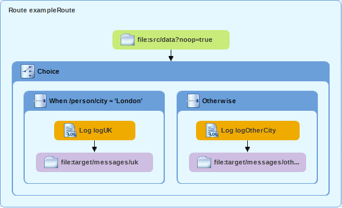

Chapter19 - JBoss Fuse Tooling
------------------------------

### 19.1.1 JBoss Fuse Tooling

This is a Camel example used to demonstrate the JBoss Fuse Tooling that has Camel editing and debugging capabilities, which you can run from Eclipse.

#### Installing JBoss Fuse Tooling in Eclipse

You need to use Eclipse Neon 4.6

From Eclipse you choose `Help` -> `Eclipse Marketplace...`
  and then type `Camel` in the find field and press the Go button. 

In the selection list search select `Red Hat Developer Studio Integration Stack` which is the 
name chosen for the Camel and integration tools as part of the Red Hat JBoss Fuse product.

Then click `Install` on the selected and prepare for it to download and install a bunch of stuff which can take some time.

If the editor does not seem to be installing, then mind that its known to happen that a license agreement confirmation
box may show up below the window so you have to move the windows to find it.

After you restart Eclipse then you still need to install more. In the `Install/Update` page which is shown
on the center of the screen, select

    JBoss Fuse Development
    
And click the `Install` button. In any wizards that shows up, then click `Next` to install all the features
and to accept any license agreements.

The tooling is open source and free to use.

You can find the source code of the tooling at github: https://github.com/jbosstools/jbosstools-fuse
   
    
#### Using the editor

Open the `camel-context.xml` XML file which has the Camel route. The Camel route will be displayed graphically:

You can now use the graphical drag'n'drop editor to edit the EIP patterns.
The editor is 2-way editor, so you can always edit the XML source directly, and switch over
to the graphical editor, and continue editing. There is no lock-in.

#### Going further

The tooling is providing several features:
- Graphical Route Editor (as seen in previous paragraph)
- Graphical Data Mapper
- Integrated debugger: debugging can be done on the graphical editor and in the Java code
- Monitoring by connecting to the JMX Camel MBean
- Deployment on different Runtimes: facilities to deploy locally, on Karaf/FUSE, on Wildfly/JBoss EAP and on OpenShift.

For more details see: http://tools.jboss.org/features/fusetools.html

